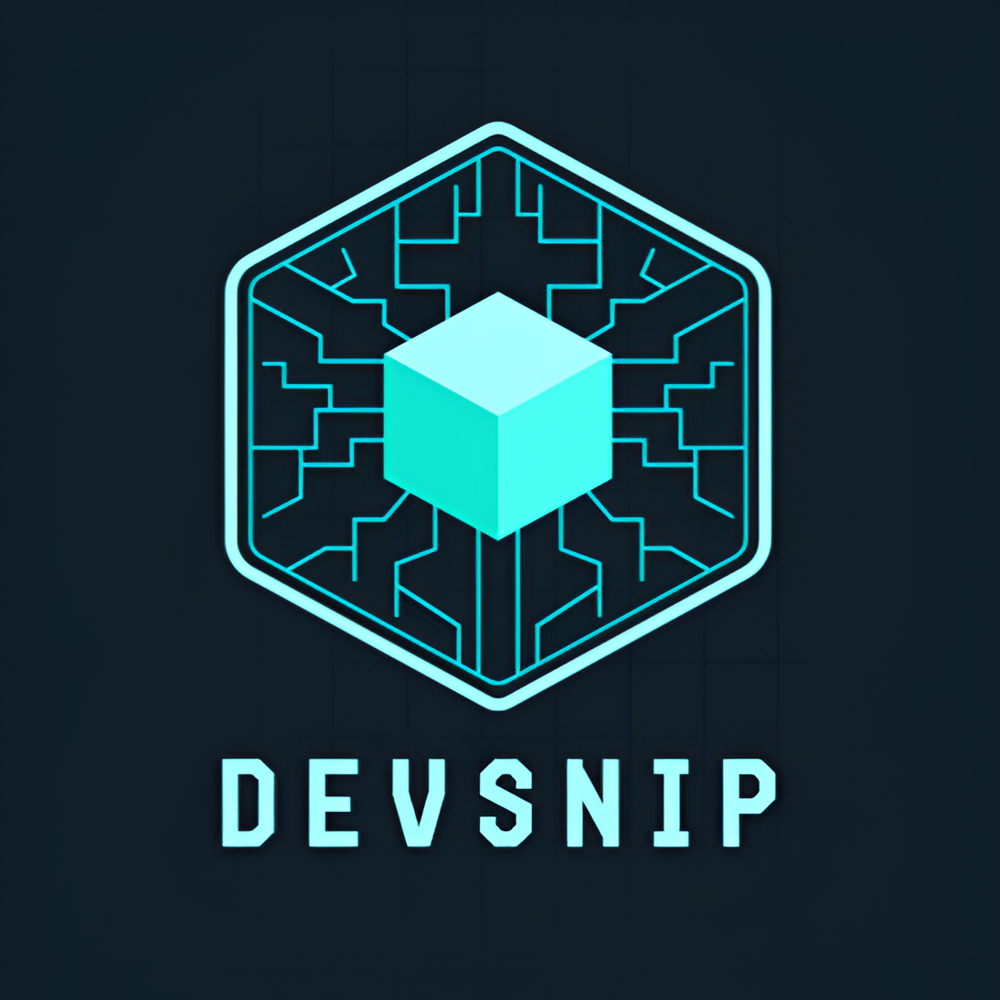
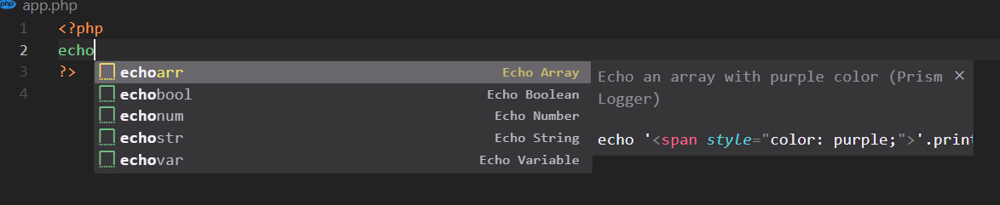

<div align="center">



# DevSnip Pro

### 🚀 The Ultimate All-in-One Developer Productivity, AI/ML, Big Data, RAG, Security, & DevOps Ecosystem for VS Code

[](https://marketplace.visualstudio.com/items?itemName=sayaib.hue-console)
[](https://marketplace.visualstudio.com/items?itemName=sayaib.hue-console)
[](https://marketplace.visualstudio.com/items?itemName=sayaib.hue-console)
[](https://marketplace.visualstudio.com/items?itemName=sayaib.hue-console&ssr=false#review-details)

<p align="center">
  <b>Transform your editor into an absolute powerhouse. Over 50+ professional tools across 6 specialized hubs — zero bloat, lightning fast.</b>
</p>

[Quick Start](#-quick-start) • [Visual Showcase](#-visual-showcase) • [Feature Hubs](#-power-hubs--feature-matrix) • [Tech Stack](#-supported-languages--technologies) • [Shortcuts](#-keyboard-shortcuts) • [Config](#-configuration)

</div>

---

## ✨ Why DevSnip Pro?

Stop juggling 10 different browser tabs, standalone API clients, JSON formatters, and terminal scripts. **DevSnip Pro** brings enterprise-grade developer tooling directly into your sidebar with a gorgeous, unified interface.

- **🔥 50+ Built-in Tools:** From REST API testing and regex building to LLM cost estimation and Spark SQL formatting.
- **🤖 Dedicated AI & MLOps Hub:** Token counters, prompt template managers, model card generators, and VRAM calculators.
- **🗄️ Big Data & RAG Powerhouse:** Parquet/Avro schema viewers, chunking strategy testers, embedding cost estimators, and RAG evaluators.
- **🛡️ Enterprise Security & DevOps:** Hardcoded secret scans, cloud security audits, and automated Dockerfile/Kubernetes manifest generation.

---

## 📸 Visual Showcase

<div align="center">


### ⚡ Seamless Sidebar Integration & Rich GUIs

<br>




</div>

---

## 🚀 Quick Start

> **Launch DevSnip Pro instantly using any of these 3 methods:**

| Method                 | Action                                                                                       | Description                                         |
| :--------------------- | :------------------------------------------------------------------------------------------- | :-------------------------------------------------- |
| **1. Activity Bar**    | Click the **DevSnip Pro** icon 🧩                                                            | Opens a clean, searchable tree grouped by workflows |
| **2. Command Palette** | <kbd>Ctrl</kbd>+<kbd>Shift</kbd>+<kbd>P</kbd> / <kbd>Cmd</kbd>+<kbd>Shift</kbd>+<kbd>P</kbd> | Type `DevSnip Pro` to access all commands           |
| **3. Context Menu**    | Right-click in editor                                                                        | Access quick tools directly from selected code      |

---

## 🧭 Power Hubs & Feature Matrix

Explore the comprehensive toolset built into DevSnip Pro:

### 🛠️ 1. Core & Developer Utilities

| Feature                     | Command / Trigger                             | Description                                                    |
| :-------------------------- | :-------------------------------------------- | :------------------------------------------------------------- |
| **REST API Client**         | `sayaib.hue-console.openGUI`                  | Full HTTP/GraphQL client with headers, auth, cookies & history |
| **Console Log Cleanup**     | `sayaib.hue-console.listAndRemoveConsoleLogs` | Scan and remove `console.log` statements project-wide          |
| **Unused Imports Remover**  | `sayaib.hue-console.removeUnusedImports`      | Automatically strip unused import statements                   |
| **README Viewer & Manager** | `sayaib.hue-console.readmeManager`            | View, edit, create, and manage workspace README.md files       |
| **Regex Builder & Tester**  | `sayaib.hue-console.regexBuilder`             | Live pattern matching and component explanations               |
| **JSON/XML Formatter**      | `sayaib.hue-console.jsonFormatter`            | Format, minify, validate, and syntax highlight                 |
| **Hash Generator**          | `sayaib.hue-console.hashGenerator`            | Generate SHA-1, SHA-256, SHA-384, SHA-512 hashes               |
| **Base64 Encoder/Decoder**  | `sayaib.hue-console.base64Encoder`            | Encode/decode strings with UTF-8 support                       |
| **URL Encoder/Decoder**     | `sayaib.hue-console.urlEncoder`               | Encode/decode components and full URLs                         |
| **Timestamp Converter**     | `sayaib.hue-console.timestampConverter`       | Convert between Unix timestamps and human dates                |
| **JSON to TOON Converter**  | `sayaib.hue-console.jsonToToon`               | Tree Outline notation for fast data reviews                    |
| **Color Palette Manager**   | `sayaib.hue-console.colorPalette`             | Color picker, shade generator & WCAG contrast checker          |
| **Lorem Ipsum Generator**   | `sayaib.hue-console.loremGenerator`           | Generate placeholder text with custom lengths                  |
| **Milestone Tracker**       | `sayaib.hue-console.milestoneTracker`         | Track development milestones and activity                      |

### 📦 2. Snippets & Templates

| Feature                       | Command / Trigger                        | Description                                                                |
| :---------------------------- | :--------------------------------------- | :------------------------------------------------------------------------- |
| **Custom Snippet Manager**    | `sayaib.hue-console.createCustomSnippet` | Create, save, and reuse custom code snippets                               |
| **Pre-built Snippet Library** | `sayaib.hue-console.showSnippets`        | **500+ snippets** across **30+ languages** (React, Python, Java, Go, etc.) |

### 🤖 3. AI & ML Tools Hub (`sayaib.hue-console.aiMlHub`)

| Feature                      | Command / Trigger                       | Description                                              |
| :--------------------------- | :-------------------------------------- | :------------------------------------------------------- |
| **Token Counter & Cost**     | `sayaib.hue-console.tokenCounter`       | Count LLM tokens and estimate API costs                  |
| **Prompt Template Manager**  | `sayaib.hue-console.promptTemplate`     | Manage templates with `{{variable}}` substitution        |
| **Python ML Code Generator** | `sayaib.hue-console.mlCodeGen`          | PyTorch, TensorFlow, HuggingFace & LangChain boilerplate |
| **LLM API Tester**           | `sayaib.hue-console.llmApiTester`       | Test OpenAI, Anthropic, Gemini & Ollama endpoints        |
| **Dataset Split Calculator** | `sayaib.hue-console.datasetSplit`       | Train/val/test splits with stratification                |
| **GPU VRAM Calculator**      | `sayaib.hue-console.gpuVram`            | Estimate VRAM by model size and precision                |
| **Experiment Logger**        | `sayaib.hue-console.experimentLogger`   | Log hyperparams/metrics with Markdown export             |
| **Model Card Generator**     | `sayaib.hue-console.modelCard`          | Generate HuggingFace-format model docs                   |
| **JSONL Viewer**             | `sayaib.hue-console.jsonlViewer`        | Parse & inspect training data in table format            |
| **Markdown Table Generator** | `sayaib.hue-console.mdTableGen`         | Generate clean markdown tables                           |
| **Dataset Profiler**         | `sayaib.hue-console.datasetProfiler`    | Inspect dataset columns & distributions                  |
| **Model Metrics Calculator** | `sayaib.hue-console.metricsCalculator`  | Calculate accuracy, F1, precision, recall                |
| **Prompt Playground**        | `sayaib.hue-console.promptPlayground`   | Interactive prompt experimentation                       |
| **LR Scheduler Visualizer**  | `sayaib.hue-console.lrScheduler`        | Visualize learning rate schedules                        |
| **Inference Estimator**      | `sayaib.hue-console.inferenceEstimator` | LLM inference speed and memory estimator                 |

### 🗄️ 4. Big Data Tools Hub (`sayaib.hue-console.bigDataHub`)

| Feature                  | Command / Trigger                       | Description                                       |
| :----------------------- | :-------------------------------------- | :------------------------------------------------ |
| **Schema Viewer**        | `sayaib.hue-console.schemaViewer`       | Interactive tree for Parquet, Avro & JSON schemas |
| **Spark SQL Formatter**  | `sayaib.hue-console.sparkSqlFormatter`  | Format Spark SQL, Presto, and Trino queries       |
| **Data Quality Checker** | `sayaib.hue-console.dataQualityChecker` | Scan datasets for missing values and duplicates   |
| **Schema Diff Tool**     | `sayaib.hue-console.schemaDiff`         | Compare two JSON schemas side-by-side             |
| **Partition Calculator** | `sayaib.hue-console.partitionCalc`      | Optimize Hadoop/Hive partitions and Spark configs |
| **Delta Lake Analyzer**  | `sayaib.hue-console.deltaLakeAnalyzer`  | Inspect Delta Lake transaction logs               |
| **Spark Cost Estimator** | `sayaib.hue-console.sparkCostEstimator` | Estimate Spark cluster execution costs            |

### 🧬 5. RAG & Vector Search Hub (`sayaib.hue-console.ragHub`)

| Feature                       | Command / Trigger                             | Description                                           |
| :---------------------------- | :-------------------------------------------- | :---------------------------------------------------- |
| **Chunking Strategy Tester**  | `sayaib.hue-console.chunkingTester`           | Compare fixed, sentence, recursive & overlap chunking |
| **Embedding Cost Calculator** | `sayaib.hue-console.embeddingCost`            | Calculate embedding costs (OpenAI, Cohere, etc.)      |
| **Context Window Calculator** | `sayaib.hue-console.contextWindow`            | Visual utilization bars and token budgeting           |
| **Semantic Dedup Checker**    | `sayaib.hue-console.semanticDedup`            | Find near-duplicate lines using n-gram similarity     |
| **RAG Eval Calculator**       | `sayaib.hue-console.ragEvalScores`            | Precision, recall, MRR, and faithfulness metrics      |
| **Hybrid Search RRF**         | `sayaib.hue-console.hybridSearchRrf`          | Reciprocal Rank Fusion simulation                     |
| **Hallucination Analyzer**    | `sayaib.hue-console.ragHallucinationAnalyzer` | Analyze RAG response grounding                        |

### 🛡️ 6. Production Security, DevOps & Observability

| Feature                    | Command / Trigger                         | Description                                            |
| :------------------------- | :---------------------------------------- | :----------------------------------------------------- |
| **Security Audit**         | `sayaib.hue-console.securityAudit`        | Bounded scan for hardcoded secrets, keys & unsafe code |
| **Cloud Security Audit**   | `sayaib.hue-console.cloudSecurityAudit`   | Scan Terraform, K8s, Docker & IAM for public exposure  |
| **DevOps Generator**       | `sayaib.hue-console.devopsGenerator`      | Generate Dockerfiles, Compose & GitHub Actions         |
| **AI/ML DevOps Generator** | `sayaib.hue-console.mlopsGenerator`       | CPU/GPU containers & K8s serving manifests             |
| **Log Analyzer**           | `sayaib.hue-console.observabilityAnalyze` | Inspect log levels, JSON structure & recommendations   |
| **Observability Starter**  | `sayaib.hue-console.observabilityStarter` | OpenTelemetry starters for Node.js / Python            |

---

## 💻 Supported Languages & Technologies

- **Frontend & Mobile:** JavaScript, TypeScript, React, Vue.js, HTML, CSS, Tailwind, Flutter, Swift, Kotlin
- **Backend & Database:** Node.js, Python, PHP, Java, C#, Go, Ruby, SQL, MongoDB, Spark, Delta Lake
- **DevOps & Cloud:** Docker, Kubernetes, Terraform, GitHub Actions, OpenTelemetry

---

## ⌨️ Keyboard Shortcuts

Add these shortcuts to your VS Code `keybindings.json` for lightning-fast access:

```json
[
  {
    "key": "ctrl+shift+a",
    "command": "sayaib.hue-console.openGUI",
    "when": "editorTextFocus"
  },
  {
    "key": "ctrl+shift+s",
    "command": "sayaib.hue-console.createCustomSnippet",
    "when": "editorTextFocus"
  },
  {
    "key": "ctrl+shift+l",
    "command": "sayaib.hue-console.listAndRemoveConsoleLogs",
    "when": "editorTextFocus"
  }
]
```

---

## ⚙️ Configuration

Customize behavior in your VS Code `settings.json`:

```json
{
  "devsnip.autoSuggest": true,
  "devsnip.snippetPreview": true,
  "devsnip.apiTimeout": 30000,
  "devsnip.consoleLogCleanup.confirmBeforeDelete": true
}
```

---

## 🤝 Contributing & Support

- **Documentation & Guides:** [Official Docs](https://sayaibsarkar.net/#/dev-snip-pro/document/en)
- **Report Bugs / Requests:** [GitHub Issues](https://github.com/sayaib/DevSnip-Pro/issues)
- **Marketplace Review:** [VS Code Marketplace](https://marketplace.visualstudio.com/items?itemName=sayaib.hue-console&ssr=false#review-details)

<div align="center">

### Show Your Support

[](https://github.com/sayaib/DevSnip-Pro)
[](https://github.com/sponsors/sayaib)

**Made with ❤️ by [Sayaib Sarkar](https://www.linkedin.com/in/sayaib/)**

</div>
