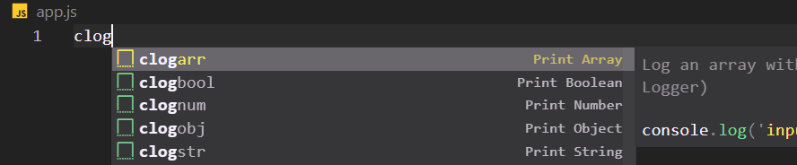

<div align="center">

# DevSnip Pro

### The Ultimate Developer Productivity Extension for VS Code

[](https://marketplace.visualstudio.com/items?itemName=sayaib.hue-console)
[](https://marketplace.visualstudio.com/items?itemName=sayaib.hue-console)
[](https://marketplace.visualstudio.com/items?itemName=sayaib.hue-console)
[](https://marketplace.visualstudio.com/items?itemName=sayaib.hue-console&ssr=false#review-details)


**39 built-in tools** across API testing, code snippets, developer utilities, AI/ML tools, Big Data tools, and RAG tools — all inside VS Code.

[Installation](#installation) | [Features](#features) | [Quick Start](#quick-start) | [Documentation](#documentation) | [Contributing](#contributing)

</div>

---

## Table of Contents

- [Features Overview](#features-overview)
- [Installation](#installation)
- [Quick Start](#quick-start)
- [How to Access](#how-to-access)
- [Features](#features)
  - [REST API Client](#1-rest-api-client)
  - [Custom Snippets](#2-custom-snippet-management)
  - [Pre-built Snippet Library](#3-pre-built-snippet-library)
  - [Console Log Cleanup](#4-console-log-cleanup)
  - [Unused Imports Remover](#5-unused-imports-remover)
  - [Code Snapshots](#6-code-snapshots)
  - [Advanced Developer Tools](#7-advanced-developer-tools)
  - [AI/ML & LLM Tools](#8-ai--ml--llm-tools)
  - [Big Data Tools](#9-big-data-tools)
  - [RAG Tools](#10-rag-tools)
- [Supported Technologies](#supported-technologies)
- [Configuration](#configuration)
- [Contributing](#contributing)
- [License](#license)
- [Support](#support)

---

## Features Overview

| Category | Tools | Description |
|----------|-------|-------------|
| API Testing | 1 | Full-featured REST/GraphQL client with environments, auth, cookies, and history |
| Snippet Management | 3 | Create custom snippets, browse 500+ pre-built snippets across 30+ languages |
| Code Cleanup | 2 | Remove console logs and unused imports across your entire project |
| Code Snapshots | 1 | Generate beautiful, shareable code images with customizable themes |
| Advanced Dev Tools | 9 | Regex builder, JSON/XML formatter, hash generator, Base64, URL encoder, color palette, timestamp converter, lorem generator, JSON to TOON |
| AI/ML & LLM Tools | 10 | Token counter, prompt manager, model comparison, embedding cost calculator, and more |
| Big Data Tools | 5 | Schema viewer, SQL formatter, data pipeline builder, and more |
| RAG Tools | 5 | Chunking strategy tester, embedding cost calculator, vector DB simulator, and more |

---

## Installation

### VS Code Marketplace (Recommended)

1. Open VS Code
2. Go to Extensions (`Ctrl+Shift+X` / `Cmd+Shift+X`)
3. Search for **"DevSnip Pro"**
4. Click **Install**

### Command Line

```bash
code --install-extension sayaib.hue-console
```

### Manual (VSIX)

1. Download the `.vsix` from the [Marketplace](https://marketplace.visualstudio.com/items?itemName=sayaib.hue-console)
2. In VS Code, open Command Palette (`Ctrl+Shift+P` / `Cmd+Shift+P`)
3. Run **"Extensions: Install from VSIX"**
4. Select the downloaded file

---

## Quick Start

After installation, find the **DevSnip Pro icon** in the Activity Bar (left sidebar). Click it to see all available tools.

### Access Methods

| Method | How |
|--------|-----|
| **Activity Bar** | Click the DevSnip Pro icon in the left sidebar |
| **Command Palette** | `Ctrl+Shift+P` / `Cmd+Shift+P` then type `DevSnip Pro:` |
| **Context Menu** | Right-click in any code file for context-specific actions |

---

## How to Access

### Activity Bar

Click the **DevSnip Pro** icon in the left sidebar to open the features panel.

### Command Palette

Press `Ctrl+Shift+P` (Cmd+Shift+P on Mac), then type `DevSnip Pro:` to see all commands.

### Available Commands

| Command | Description |
|---------|-------------|
| `DevSnip Pro: Open REST API Client` | Launch the API testing tool |
| `DevSnip Pro: Show Custom Snippets` | Browse your saved snippets |
| `DevSnip Pro: Create Custom Snippet` | Create a new code snippet |
| `DevSnip Pro: List and Remove Console Logs` | Find and clean console.log statements |
| `DevSnip Pro: Remove Unused Imports` | Clean up unused imports |
| `DevSnip Pro: Capture Code Snapshot` | Create a visual code image |
| `DevSnip Pro: Advanced Developer Tools Hub` | Open the tools hub |
| `DevSnip Pro: AI/ML & LLM Tools Hub` | Open AI/ML tools |
| `DevSnip Pro: Big Data Tools Hub` | Open Big Data tools |
| `DevSnip Pro: RAG Tools Hub` | Open RAG tools |

---

## Features

### 1. REST API Client

A full-featured API client built directly into VS Code — no need to switch to Postman or Insomnia.



**Capabilities:**

- All HTTP methods: `GET` `POST` `PUT` `DELETE` `PATCH` `HEAD` `OPTIONS`
- GraphQL support with query editor, variables, and operation name
- Request headers and body (JSON, text, form data)
- Bearer Token and Basic Auth authentication
- Query parameter builder
- Environment variables with `{{variable}}` syntax
- Cookie management (view, copy, clear per domain)
- Request history with status, response time, and size
- JSON syntax highlighting in responses
- Configurable timeout (1–300 seconds)
- Cancel in-flight requests
- cURL paste support

**How to Use:**

1. Open the API Client from the Activity Bar or Command Palette
2. Select the HTTP method from the dropdown
3. Enter the request URL
4. Configure headers, auth, body, or GraphQL query as needed
5. Click **Send**
6. View the response with syntax highlighting and timing info

---

### 2. Custom Snippet Management

Create, organize, and reuse your own code snippets.

**How to Create:**

1. Select code in the editor
2. Right-click and choose **"DevSnip Pro: Create Custom Snippet"**
3. Fill in the prefix, name, and description
4. Save — your snippet is now available via autocomplete

**Using Snippets:**

1. Type your snippet prefix in any file
2. Select from autocomplete suggestions
3. Press `Tab` to insert

**Example:**

```javascript
// Prefix: "apihandler"
// Name: "Express API Handler"
app.get('/api/${1:endpoint}', async (req, res) => {
  try {
    const ${2:data} = await ${3:service}.${4:method}();
    res.json({ success: true, data: ${2:data} });
  } catch (error) {
    res.status(500).json({ success: false, error: error.message });
  }
});
```

---

### 3. Pre-built Snippet Library

Access **500+** carefully crafted snippets across **30+** technologies:

| Category | Languages/Frameworks |
|----------|---------------------|
| Frontend | JavaScript, TypeScript, React, Vue.js, HTML, CSS |
| CSS Frameworks | Bootstrap, Tailwind CSS |
| Backend | Node.js, Python, PHP, Java, C#, Go, Ruby |
| Mobile | Flutter/Dart, Swift, Kotlin |
| Database | MongoDB, SQL |
| State Management | Redux, React Query, React Router |
| Other | JSON, YAML, Markdown, Shell Scripts |

Browse snippets via Command Palette: `DevSnip Pro: Show Custom Snippets`

---

### 4. Console Log Cleanup

Detect and remove `console.log` statements across your entire project.

**Features:**

- Project-wide scan for all `console.log` statements
- Preview before deletion
- Selective or bulk removal
- Multiline log support
- Preserves `console.error`, `console.warn`, etc. (configurable)

**How to Use:**

1. Open Command Palette (`Ctrl+Shift+P`)
2. Run **"DevSnip Pro: List and Remove Console Logs"**
3. Review detected statements
4. Remove all or select specific ones

**Before:**

```javascript
function calculateTotal(items) {
  console.log('Starting calculation');
  let total = 0;
  items.forEach(item => {
    console.log('Processing:', item);
    total += item.price;
  });
  console.log('Total:', total);
  return total;
}
```

**After:**

```javascript
function calculateTotal(items) {
  let total = 0;
  items.forEach(item => {
    total += item.price;
  });
  return total;
}
```

---

### 5. Unused Imports Remover

Automatically detect and remove unused import statements from your code.

**How to Use:**

1. Open Command Palette (`Ctrl+Shift+P`)
2. Run **"DevSnip Pro: Remove Unused Imports"**
3. Unused imports are removed from the current file

---

### 6. Code Snapshots

Generate beautiful, shareable images of your code with customizable styling.

**Features:**

- Multiple theme options (dark, light, custom)
- Customizable background, padding, and border
- Syntax highlighting preservation
- Export as PNG
- Perfect for documentation, social media, and presentations

**How to Use:**

1. Select the code you want to capture
2. Right-click and choose **"DevSnip Pro: Capture Code Snapshot"**
3. Customize theme and styling
4. Export or copy the image

---

### 7. Advanced Developer Tools

9 professional utilities for everyday development tasks:

| Tool | What It Does |
|------|-------------|
| **Regex Builder & Tester** | Build, test, and debug regular expressions with real-time match visualization |
| **JSON/XML Formatter** | Format, minify, validate, and syntax-highlight JSON and XML |
| **Hash Generator** | Generate SHA-1, SHA-256, SHA-384, and SHA-512 cryptographic hashes |
| **Base64 Encoder/Decoder** | Encode and decode Base64 strings with full UTF-8 support |
| **URL Encoder/Decoder** | Encode and decode URL components and full URLs |
| **Timestamp Converter** | Convert between Unix timestamps and human-readable dates |
| **JSON to TOON Converter** | Convert JSON to Tree Outline notation for quick data reviews |
| **Color Palette** | Pick colors, generate shade palettes, and check WCAG contrast ratios |
| **Lorem Ipsum Generator** | Generate placeholder text with configurable length and format |

---

### 8. AI/ML & LLM Tools

10 specialized tools for AI and machine learning workflows:

| Tool | What It Does |
|------|-------------|
| **Token Counter** | Count tokens in text for LLM context window management |
| **Prompt Manager** | Create, organize, and test LLM prompts |
| **Model Comparison** | Compare pricing and capabilities across AI models |
| **Embedding Cost Calculator** | Estimate costs for embedding operations |
| **AI Response Evaluator** | Evaluate quality of LLM responses |
| **ML Hyperparameter Tracker** | Track and log hyperparameter configurations |
| **Dataset Splitter** | Split datasets into train/validation/test sets |
| **Confusion Matrix Builder** | Build and visualize classification confusion matrices |
| **Loss Function Selector** | Choose the right loss function for your ML task |
| **Regex Pattern Library for AI** | Pre-built regex patterns for NLP and text processing |

---

### 9. Big Data Tools

5 tools for data engineering and Big Data workflows:

| Tool | What It Does |
|------|-------------|
| **Schema Viewer** | Visualize and explore database schemas |
| **SQL Formatter** | Format and beautify SQL queries |
| **Data Pipeline Builder** | Design and document data pipelines |
| **CSV/JSON Data Explorer** | Explore and transform tabular data |
| **Data Quality Checker** | Validate data quality and detect anomalies |

---

### 10. RAG Tools

5 tools for Retrieval-Augmented Generation workflows:

| Tool | What It Does |
|------|-------------|
| **Chunking Strategy Tester** | Test different text chunking strategies |
| **Embedding Cost Calculator** | Calculate costs for vector embedding operations |
| **Vector DB Simulator** | Simulate vector database operations |
| **RAG Pipeline Builder** | Design and test RAG pipelines |
| **Similarity Search Tester** | Test and compare similarity search algorithms |

---

## Supported Technologies

<div align="center">

**Frontend**


**CSS Frameworks**


**Backend & Database**


**Mobile**


</div>

**Full language list:** JavaScript, TypeScript, React, Vue.js, HTML, CSS, Node.js, Python, PHP, Java, C#, Go, Ruby, Flutter/Dart, Swift, Kotlin, Bootstrap, Tailwind CSS, Redux, React Query, React Router, MongoDB, SQL, JSON, YAML, Markdown, Shell Scripts, and more.

---

## Keyboard Shortcuts

Add custom shortcuts in your VS Code `keybindings.json`:

```json
[
  {
    "key": "ctrl+shift+a",
    "command": "sayaib.hue-console.openGUI",
    "when": "editorTextFocus"
  },
  {
    "key": "ctrl+shift+s",
    "command": "sayaib.hue-console.createCustomSnippet",
    "when": "editorTextFocus"
  },
  {
    "key": "ctrl+shift+l",
    "command": "sayaib.hue-console.listAndRemoveConsoleLogs",
    "when": "editorTextFocus"
  }
]
```

---

## Configuration

DevSnip Pro works out of the box. Optionally customize via VS Code `settings.json`:

```json
{
  "devsnip.autoSuggest": true,
  "devsnip.snippetPreview": true,
  "devsnip.apiTimeout": 30000,
  "devsnip.mongoConnectionTimeout": 10000,
  "devsnip.codeSnapshotTheme": "dark",
  "devsnip.consoleLogCleanup.confirmBeforeDelete": true
}
```

---

## Contributing

Contributions are welcome! Here's how:

### Report Bugs

Found an issue? [Open a bug report](https://github.com/sayaib/DevSnip-Pro/issues)

### Suggest Features

Have an idea? [Submit a feature request](https://github.com/sayaib/DevSnip-Pro/issues)

### Development Setup

```bash
git clone https://github.com/sayaib/DevSnip-Pro.git
cd DevSnip-Pro
npm install
code .
npm run watch
```

### Pull Request Process

1. Fork the repository
2. Create a feature branch (`git checkout -b feature/amazing-feature`)
3. Commit changes (`git commit -m 'Add amazing feature'`)
4. Push (`git push origin feature/amazing-feature`)
5. Open a Pull Request

---

## License

MIT License — see [LICENSE.txt](LICENSE.txt) for details.

- Free for personal and commercial use
- Modify and distribute as needed
- Attribution appreciated but not required

---

## Support

### Resources

- [Documentation](https://sayaibsarkar.net/#/dev-snip-pro/document/en)
- [Video Tutorials](https://sayaibsarkar.net/#/dev-snip-pro/document/en)
- [GitHub Repository](https://github.com/sayaib/DevSnip-Pro)

### Found a Bug?

1. Check [existing issues](https://github.com/sayaib/DevSnip-Pro/issues)
2. Search the [documentation](https://sayaibsarkar.net/#/dev-snip-pro/document/en)
3. [Create a new issue](https://github.com/sayaib/DevSnip-Pro/issues/new) with:
   - VS Code version
   - DevSnip Pro version
   - OS and steps to reproduce
   - Screenshots if helpful

### Stay Updated

- Star the repo to get notified of updates
- Watch releases for new features
- Rate and review on the [VS Code Marketplace](https://marketplace.visualstudio.com/items?itemName=sayaib.hue-console&ssr=false#review-details)

---

<div align="center">

### Show Your Support

[](https://github.com/sayaib/DevSnip-Pro)
[](https://github.com/sponsors/sayaib)
[](https://marketplace.visualstudio.com/items?itemName=sayaib.hue-console&ssr=false#review-details)

**Made with heart by [Sayaib Sarkar](https://github.com/sayaib)**

</div>
