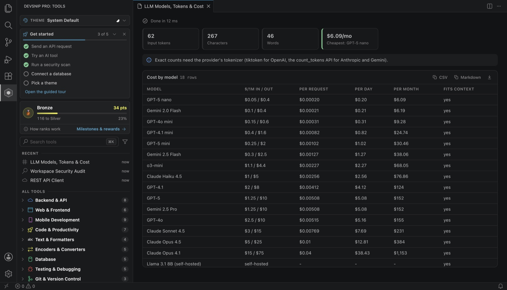

# How to count LLM tokens and estimate cost in VS Code

**Short answer:** paste your prompt into a token counter and multiply by each model's price. In VS Code, run **DevSnip Pro: LLM Models, Tokens & Cost** from [DevSnip Pro](https://marketplace.visualstudio.com/items?itemName=sayaib.hue-console): it estimates tokens and the cost per request, per day and per month across 18 chat models, locally and without an API key.

Building on large language models brings a set of everyday questions: how many tokens is this prompt, what will a million calls cost, why does the model's "JSON" not parse, and how many retrieved chunks fit in the context window? None of these needs a chat assistant. They need small, deterministic tools next to the code that calls the model. All the tools below are in the **AI & ML** and **Data & RAG** sections of the DevSnip Pro sidebar, run locally and need no API key.

## Estimate tokens and cost before you ship

Run **DevSnip Pro: LLM Models, Tokens & Cost** and paste a real prompt, including the system prompt and a typical user message. Token counts are estimates, not a provider's exact tokenizer. It estimates tokens and the cost per request, per day and per month across 18 chat models, or compares context windows and prices side by side.

Model prices change often. Treat the built-in table as an estimate and confirm against your provider's pricing page before committing to a budget.

## Write prompts that are easy to maintain

**Prompt Builder** fills a template with variables, flags common mistakes (an unfilled `{{variable}}`, no system prompt, asking for JSON without showing its shape, long inserted text without delimiters) and exports the API payload for your provider. Keeping prompts as templates makes them reviewable like any other code.

If your prompt embeds structured data, **JSON → TOON** rewrites JSON into a compact, lossless notation. That typically saves 30–60% of the tokens for tabular data.

## Make model output safe to parse

Models wrap JSON in prose, add trailing commas, or truncate an answer. **LLM Output Cleaner & JSON Validator** extracts the JSON from a reply, repairs common damage and validates it, so you can see exactly what your parser will receive. Pair it with **JSON Schema Validator** to check the result against your contract.

## Plan retrieval (RAG) with numbers

- **Chunking Tester:** compare chunk sizes and strategies on your own text before embedding anything.
- **Context Window Budget:** how many chunks fit next to the system prompt, history and answer.
- **Chunk & Index Size Calculator:** number of chunks, embedding cost, vector storage and index RAM for a corpus.
- **Answer Grounding Checker:** which sentences of an answer the retrieved context actually supports.
- **Near-Duplicate Chunk Finder:** repeated passages that waste index space and crowd out results.

## Start a project with the right boilerplate

- **LLM Client Setup:** a configured client for OpenAI, Anthropic, Gemini, Azure OpenAI, Ollama or any OpenAI-compatible endpoint.
- **AI App Starter:** a runnable AI app project for your stack.
- **GPU Memory & Speed:** whether a model fits on a GPU, and roughly how fast it will run.

## Call real models when you need to

The REST API Client knows the request shape of each major provider. It can send a prompt, stream the reply, show tokens, latency and cost, and validate the output against a schema. Comparing several models side by side, benchmarking, and testing embeddings, vector databases and RAG pipelines are advanced tools paid for with points. Your API keys are used for the request and never written to history or disk.

## Pair it with a coding agent

If you use an AI coding agent in the terminal, **OpenCode Integration** installs, checks and launches OpenCode in your workspace. See [How to install and use OpenCode in VS Code](opencode-in-vscode.md).

---

**Try it:** [Install DevSnip Pro](https://marketplace.visualstudio.com/items?itemName=sayaib.hue-console) (free, no account) or run `code --install-extension sayaib.hue-console`.

Related: [How to install and use OpenCode in VS Code](opencode-in-vscode.md) · [How to test REST APIs in VS Code](test-rest-apis-in-vscode.md) · [All guides](README.md)
