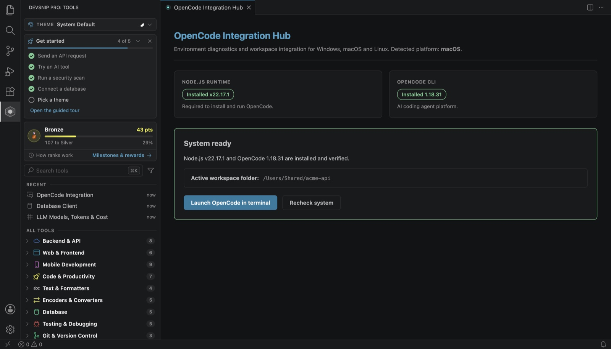

# How to install and use OpenCode in VS Code

**Short answer:** OpenCode is an AI coding agent that runs in a terminal. Install it with npm (`npm install -g opencode-ai`) or let **DevSnip Pro: OpenCode Integration** in [DevSnip Pro](https://marketplace.visualstudio.com/items?itemName=sayaib.hue-console) check Node.js, install or repair the CLI, and launch it in a terminal rooted at your workspace, on Windows, macOS and Linux.

An agent is only half of a good workflow. Two kinds of tools are useful during development:

- **Agents** write and change code from a description. They are great at boilerplate and refactors, and they need review.
- **Deterministic tools** give the same answer every time: a formatter, a token counter, a schema validator, a security scanner. They are what you use to check the agent's work and your own.

This guide sets up the agent, then shows which DevSnip Pro tools to check its work with.

## 1. Set up the agent

Run **DevSnip Pro: OpenCode Integration**. The panel:

1. checks that Node.js and the OpenCode CLI are installed;
2. installs or repairs OpenCode through npm;
3. reports success only once `opencode --version` really runs.

**Launch** opens it in a terminal rooted at your workspace. If your VS Code was started from the Dock and cannot see your `PATH`, start VS Code from a terminal or use the per-OS alternatives the panel lists.

## 2. Let the agent draft, then verify

Ask the agent for a change, for example "add a `/users/:id` endpoint with validation". Then verify the result with deterministic tools instead of trusting it:

| The agent produced… | Check it with |
| :--- | :--- |
| A new endpoint | **REST API Client**: call it, try bad input, check status codes |
| A database migration | **Database Client**: open the table's structure and the rows |
| JSON fixtures or config | **JSON / YAML / XML Formatter** and **JSON Schema Validator** |
| A Dockerfile, Compose file or workflow | **Cloud & Container Audit** |
| Anything touching secrets or auth | **Workspace Security Audit**, **JWT Decoder & Signer** |
| A prompt for your own LLM feature | **Prompt Builder** and **LLM Models, Tokens & Cost** |

## 3. Clean up before you commit

Agents and debugging sessions leave things behind:

- **Clean Console Logs** finds `console.log` calls across the workspace and removes the ones you choose.
- **Remove Unused Imports** works for JavaScript, TypeScript, Python and Java.
- **Diff Checker** compares two texts, or two JSON documents structurally.

## 4. Keep what you reuse

When you write (or the agent writes) a block you will need again, select it and run **DevSnip Pro: Create Snippet**. It is available through IntelliSense under the prefix you choose, in 39 languages.

## Why this split works

Agents are fast but probabilistic; checks are slower to set up but repeatable. Using the agent for the first draft and deterministic tools for review gives you the speed without shipping its mistakes. Because the checking tools run locally, your code is not sent anywhere to verify it.

---

**Try it:** [Install DevSnip Pro](https://marketplace.visualstudio.com/items?itemName=sayaib.hue-console) (free, no account) or run `code --install-extension sayaib.hue-console`.

Related: [How to count LLM tokens and estimate cost in VS Code](count-llm-tokens-and-cost-in-vscode.md) · [How to find hard-coded secrets in VS Code](find-hardcoded-secrets-in-vscode.md) · [All guides](README.md)
