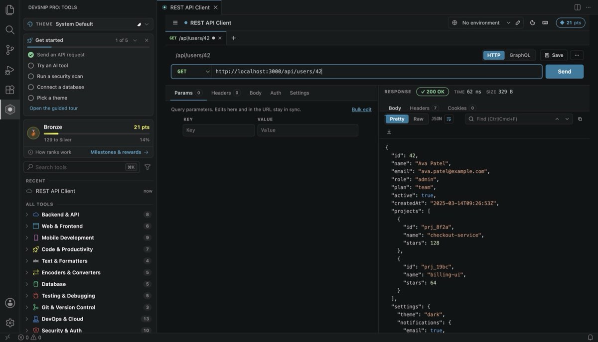

# How to test REST APIs in VS Code

**Short answer:** install a REST client extension, open it beside your code, and send requests from there. This guide uses the free REST API Client in [DevSnip Pro](https://marketplace.visualstudio.com/items?itemName=sayaib.hue-console): no account, environments, collections, cURL import and code generation. The habits it describes work with any client.



Switching between your editor and a separate API tool costs more than it seems: you copy a URL out of the code, paste a token from a `.env` file, send, then copy the JSON back to write a type or a test. Inside VS Code, the code, the request and the response stay next to each other.

## 1. Send your first request

1. Run **DevSnip Pro: REST API Client** from the Command Palette (<kbd>Ctrl/Cmd</kbd>+<kbd>Shift</kbd>+<kbd>P</kbd>), or click it in the DevSnip Pro sidebar.
2. Click **Send a sample request**. It sends `GET https://jsonplaceholder.typicode.com/todos/1`, a free public test API.
3. The response panel shows the status, time and size, formatted JSON you can search, and the headers and cookies.

For your own API, type the URL and press <kbd>Enter</kbd>. If you already have the request as a cURL command (browser dev tools: *Copy as cURL*), paste it into the URL bar: the method, headers and body are imported.

## 2. Stop hard-coding hosts and tokens

Create an **environment** for each target, such as `local` and `staging`, with variables like `baseUrl` and `token`. Then write requests as:

```
GET {{baseUrl}}/users/42
Authorization: Bearer {{token}}
```

Switching the environment reruns the same request against another server, and secrets stay out of the request you save.

## 3. Save what you will run again

Save requests into **collections**, grouped in folders that mirror your API (`auth/`, `users/`, `billing/`). History keeps everything you sent, with credential-looking URL values redacted. Saved requests become living documentation for the next person on the project.

## 4. Test the unhappy paths, not just `200 OK`

A `200` with the wrong body is still a bug. For every endpoint you touch, check:

- **Shape:** are fields present, typed as expected, and named consistently?
- **Bad input:** a missing required field and a field of the wrong type should return a clear `4xx`, not a `500` with a stack trace.
- **Auth:** an expired or missing token. **JWT Decoder & Signer** signs a test token with a past `exp`.
- **Missing resources:** a `404` with a useful message.
- **Headers:** `Content-Type`, caching headers, and CORS headers if a browser will call it (**CORS Builder & Debugger** explains CORS errors).
- **Time:** an endpoint that takes 900 ms locally will not be faster in production.

Once you have checked the same field three times, turn it into an **assertion** that runs on every send, **chain** requests (log in → create → verify), or run a **batch** to see latency percentiles. These advanced tools are paid for with points earned by using the extension; there is nothing to buy.

## 5. Turn the request into code and types

When the request works, **generate code** for it in JavaScript (fetch or Axios), Python, Go, Java or C#, or export it as cURL for a README or a bug report. To get types from the response, open **JSON to Types** from the Tools sidebar: TypeScript, Zod, Pydantic, Kotlin, Swift, Dart, Java, Go or JSON Schema.

Working from a spec? **OpenAPI / Swagger Toolkit** lints it, lists every endpoint and generates TypeScript types, a `fetch` client and cURL commands.

## 6. Check the database and security before you ship

- Open the **Database Client** to confirm the row your request wrote. See [How to connect to PostgreSQL, MySQL, MongoDB and Redis in VS Code](connect-to-postgresql-mysql-mongodb-redis-in-vscode.md).
- Run **DevSnip Pro: Endpoint Security Scan** against a URL you are authorised to test: TLS, HSTS, security headers, CSP, CORS and cookies, each with a fix. See [How to find hard-coded secrets and security issues in VS Code](find-hardcoded-secrets-in-vscode.md).

## Summary

| Step | Why it matters |
| :--- | :--- |
| Environments | One request, many servers; no secrets in saved requests |
| Collections | Repeatable checks and shared knowledge |
| Unhappy paths | Catches contract and error-handling bugs |
| Code and types | No hand-copying of URLs and JSON |
| Security scan | Misconfigured headers are cheap to fix before release |

---

**Try it:** [Install DevSnip Pro](https://marketplace.visualstudio.com/items?itemName=sayaib.hue-console) (free, no account) or run `code --install-extension sayaib.hue-console`.

Related: [How to test a GraphQL API in VS Code](test-graphql-api-in-vscode.md) · [Free Postman alternative in VS Code](postman-alternative-in-vscode.md) · [All guides](README.md)
